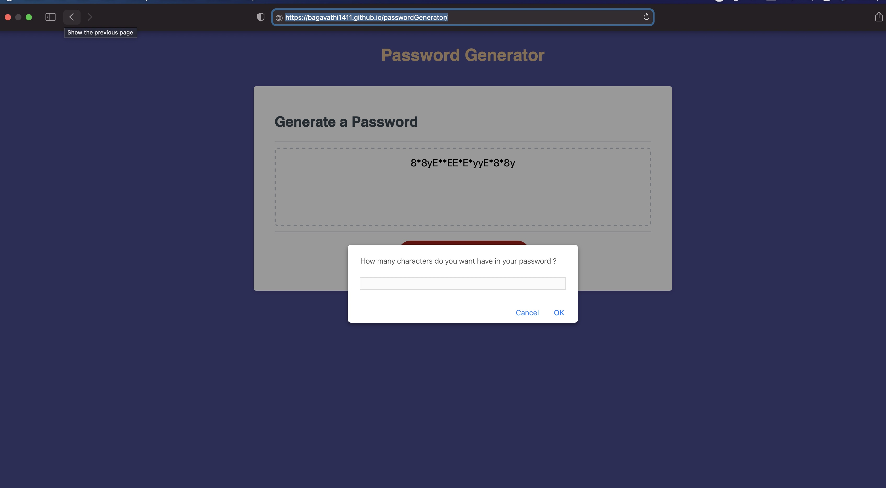

# Password generator

## Project Description:

Generating random secure password using HTML, CSS and JavaScript

# Tools,Technology and Programming Language Used:

- Markup launguage (Reference) - HTML https://developer.mozilla.org/en-US/docs/Web/HTML
- Styling CSS https://developer.mozilla.org/en-US/docs/Web/CSS
- Git Hub
- VSCode
- Browsers Chrome and Safari
- Chrome Developer Tool
- JavaScript

# Business Requirements - User Story:

## User Story

```
AS AN employee with access to sensitive data
I WANT to randomly generate a password that meets certain criteria
SO THAT I can create a strong password that provides greater security
```

## Sample Image:



## My project web page:

https://bagavathi1411.github.io/passwordGenerator/

# ## License

Copyright (c) 707 Tech Corporation - 2021. All rights reserved.
